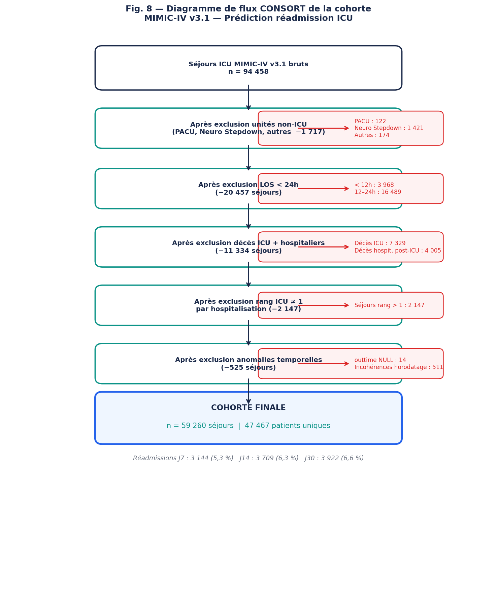
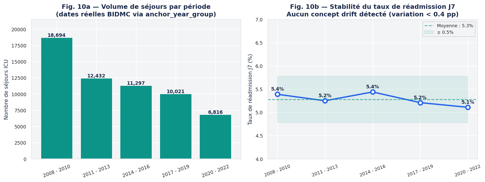
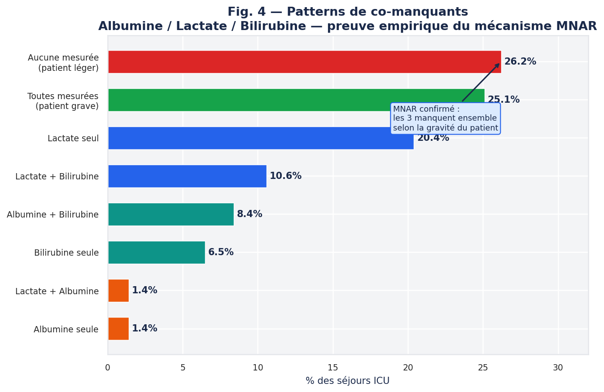
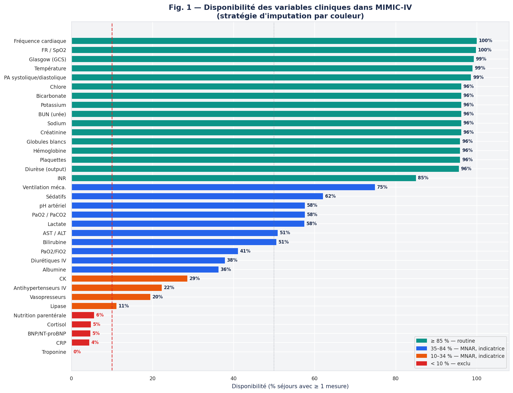
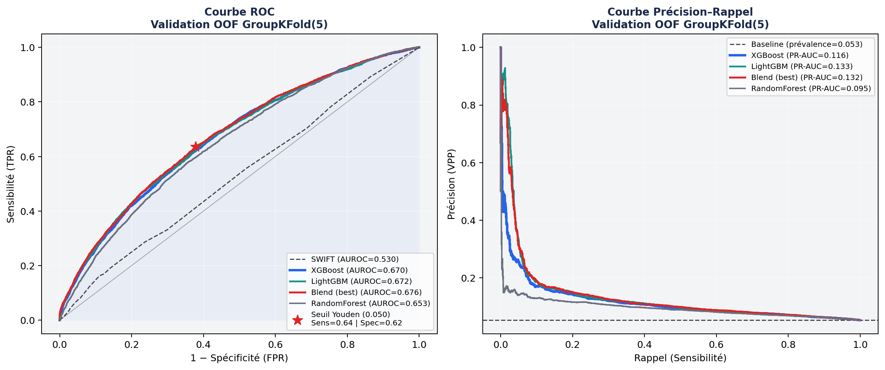
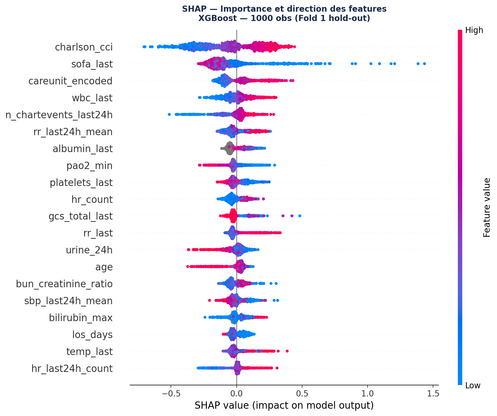
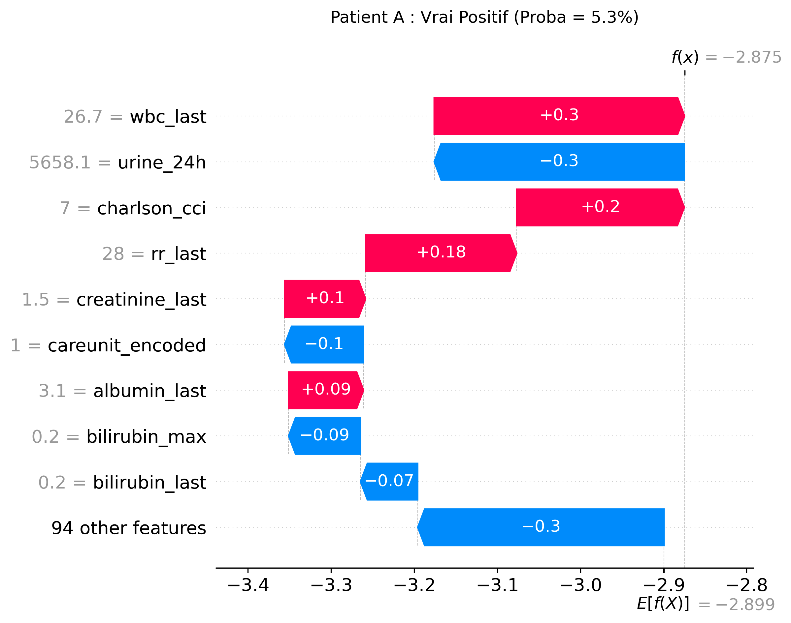
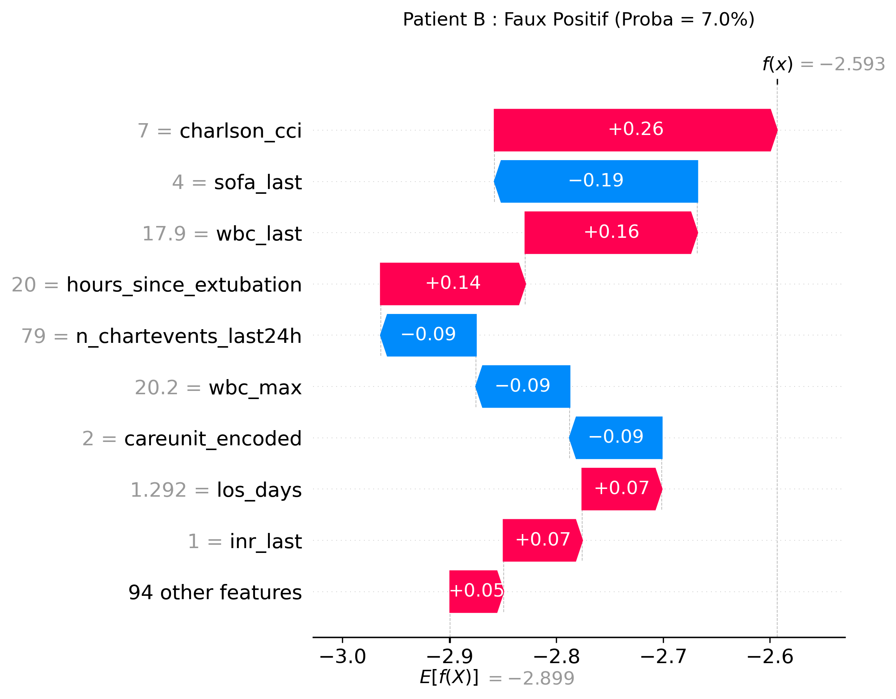
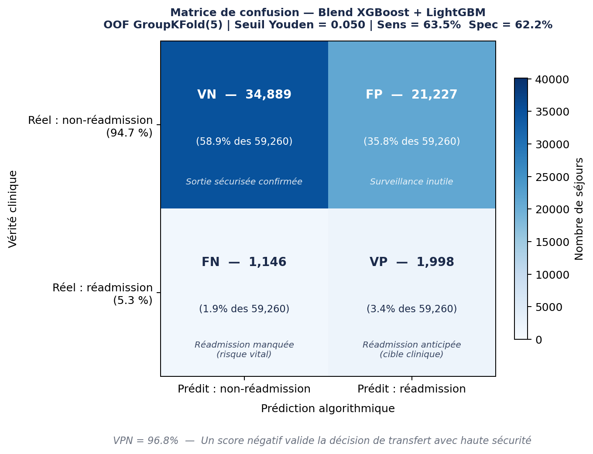

# Introduction

## Contexte clinique : Le fardeau des réadmissions en soins intensifs

Les unités de soins intensifs (ICU) constituent l'environnement hospitalier de la plus haute complexité, mobilisant des ressources technologiques et humaines considérables. Dans ce contexte, la réadmission non planifiée en réanimation est aujourd'hui reconnue internationalement comme un indicateur sensible de la qualité et de la sécurité des soins. Les études épidémiologiques récentes, menées sur de larges cohortes multicentriques, montrent que la prévalence de ces réadmissions fluctue généralement entre 5 % et 10 % de l'ensemble des sorties d'ICU(Amagai et al., 2025), (Nannan Panday et al., 2017)

L'occurrence d'une réadmission s'accompagne d'un pronostic clinique extrêmement péjoratif et d'un fardeau économique majeur. La littérature démontre que les patients réadmis subissent une surmortalité drastique, avec des taux de décès intra-hospitaliers passant d'environ 2 % pour une sortie réussie à plus de 20 % en cas de retour non planifié en réanimation (Amagai et al., 2025). Outre cette augmentation du risque de mortalité, ces événements entraînent un allongement significatif de la durée de séjour, souvent prolongée de plus d'une semaine, ce qui majore le coût hospitalier global par patient et sature les ressources critiques (Nannan Panday et al., 2017).

Malgré la gravité de ce phénomène, les analyses rétrospectives suggèrent qu'une proportion substantielle de ces réadmissions serait potentiellement évitable, la sortie prématurée constituant le principal facteur de risque modifiable. Toutefois, cette décision médicale est rarement le simple fruit d'une erreur d'évaluation clinique. Elle est lourdement influencée par des pressions systémiques inévitables telles que la saturation des lits, les impératifs de flux hospitalier et la charge cognitive extrême pesant sur les équipes médicales. Ces variables environnementales, par nature indépendantes de la physiologie du patient, sont structurellement ignorées par les scores de gravité traditionnels tels que le SOFA ou le SAPS-II.

La décision de transfert vers une unité de moindre intensité demeure ainsi l'un des arbitrages les plus complexes pour l'intensiviste. Elle exige de concilier en temps réel la sécurité individuelle d'un patient convalescent avec la nécessité absolue de libérer des ressources critiques pour de nouvelles urgences. Face à cette asymétrie d'information et à la subjectivité inhérente au jugement humain sous pression, l'intégration d'un algorithme de prédiction objectif au lit du patient représente une nécessité opérationnelle pour sécuriser le continuum de soins.

## Limites de la littérature actuelle : de la clinique à l'algorithmique

L'évaluation du risque de réadmission au moment de la sortie d'ICU s'appuie historiquement sur des scores cliniques traditionnels, dont le plus documenté reste le score SWIFT (*Stability and Workload Index for Transfer*, Gajic et al., 2008) (Gajic et al., 2008). Bien qu'il soit l'un des seuls outils validés spécifiquement pour cette tâche, le SWIFT souffre de limitations structurelles profondes. Basé sur un sous-ensemble restreint de cinq variables (source d'admission, durée de séjour, rapport PaO2/FiO2, score de Glasgow et PaCO2), sa capacité de discrimination en vie réelle s'avère insuffisante. Les évaluations externes indépendantes rapportent des AUROC particulièrement faibles, plafonnant à 0,58 sur la cohorte européenne de Kastrup et al. (2013) (Kastrup et al., 2013), et s'effondrant à 0,51 lors d'une application récente sur la base MIMIC-IV (Shi et al., 2022). Cet échec s'explique notamment par une calibration médiocre et l'absence totale de prise en compte du fardeau des comorbidités chroniques (comme le Charlson Comorbidity Index), pourtant déterminantes dans la trajectoire de dégradation post-réanimation.

Face à la faillite des scores statiques, l'application du Machine Learning a suscité un immense espoir, mais le bilan la littérature reste en demi-teinte. Des approches pionnières ont certes montré des gains initiaux, à l'image des travaux de Rojas et al. (2018) atteignant un AUROC de 0,76 sur une cohorte interne et 0,71 en validation externe sur MIMIC-III (Rojas et al., 2018). Cependant, les publications plus récentes illustrent une crise de la généralisation des modèles. L'étude de Shi et al. (2022), qui s'attaque directement à la prédiction à J7, illustre parfaitement ce phénomène : bien que leur modèle atteigne un AUROC impressionnant de 0,85 en validation interne sur la base de Stanford, ses performances chutent brutalement à 0,60 lorsqu'il est confronté aux données hétérogènes de MIMIC-IV (Shi et al., 2022). Cette perte de 25 points révèle les failles méthodologiques récurrentes de ces études, notamment l'imputation forcée qui détruit le signal d'absence d'examen (MNAR), ou le surapprentissage lié à un partitionnement naïf des données (train/test split) qui ne respecte pas l'étanchéité des identifiants patients pour ceux ayant des séjours multiples.

Enfin, l'incapacité à vérifier et corriger ces modèles découle d'une crise de la reproductibilité largement documentée en santé numérique. L'opacité des requêtes d'extraction et des protocoles de nettoyage des données empêche toute validation indépendante. Dès lors, l'enjeu scientifique actuel n'est plus la quête d'une performance interne artificielle, mais le développement d'architectures robustes, documentées de la base de données brute jusqu'à l'inférence, et soumises aux standards de la science ouverte.

## Objectifs de l'étude

**Objectif principal :** Développer un pipeline d'apprentissage automatique prédisant la réadmission non planifiée en ICU à 7 jours (J7) sur la base MIMIC-IV v3.1. L'enjeu est d'offrir une modélisation transparente, exempte de biais de fuite de données, surpassant significativement la capacité de discrimination du standard clinique actuel (score SWIFT).

Le choix de l'horizon J7 repose sur une logique de causalité clinique : une réadmission précoce est souvent le signe d'une sortie prématurée. À cet horizon, l'événement est fortement corrélé à l'état physiologique du patient et à sa stabilité réelle au moment du transfert. À l'inverse, une réadmission à J30 est plus susceptible d'être influencée par des facteurs extrinsèques au séjour initial (qualité du suivi en service, nouvelles pathologies, environnement social). Prédire le risque à J7 permet donc de capturer les variables directement liées à la décision médicale de l'intensiviste.  

**Objectifs secondaires :**

1. **Évaluation temporelle :** Comparer les prédictions sur trois horizons (J7, J14, J30) pour analyser l'évolution du risque post-sortie.

2. **Interprétabilité :** Produire des explications cliniques (SHAP) pour identifier les leviers physiologiques de réadmission et faciliter l'adoption de l'outil.

# Matériel et Méthodes

## Source des données et Construction de la cohorte

L'étude a été menée de manière rétrospective sur la base de données MIMIC-IV (*Medical Information Mart for Intensive Care*, version 3.1). Cette base contient les données pseudonymisées de séjours ICU pour des patients admis au Beth Israel Deaconess Medical Center (BIDMC) à Boston. L'accès aux données a été accordé via la plateforme PhysioNet suite à l'obtention de la certification éthique CITI. L'extraction et le traitement initial ont été réalisés via Google BigQuery, en exploitant conjointement trois modules : `mimiciv_icu` (séjours, signes vitaux, traitements), `mimiciv_hosp`(hospitalisations, bilans biologiques, diagnostics ICD-10) et `mimiciv_derived` (scores de sévérité précalculés).

Afin d'isoler une population cliniquement pertinente pour l'évaluation du risque de réadmission, la cohorte a été construite via des requêtes SQL strictes. À partir de l'ensemble des admissions en ICU documentées, plusieurs critères d'exclusion ont été appliqués en cascade.

Ont été systématiquement écartés : les séjours initiaux d'une durée inférieure à 24 heures. L'exclusion de ces séjours ultra-courts est un standard recommandé (Tschoellitsch et al. (2024)) car ils correspondent très majoritairement à de la surveillance post-opératoire élective (sans réelle sévérité) dont le recul clinique est insuffisant pour justifier une modélisation algorithmique de la dégradation (Tschoellitsch et al., 2024). 
Conformément aux protocoles rigoureux d'évaluation, les patients décédés en réanimation ou avant la sortie définitive de l'hôpital ont naturellement été exclus (Tschoellitsch et al., 2024). Enfin, les passages par des unités de soins intermédiaires (*step-down units*) ont été exclus de l'analyse, car ils altèrent drastiquement la trajectoire de risque post-ICU et constituent un biais de confusion majeur par rapport à un transfert direct en service conventionnel. Les dossiers présentant des anomalies temporelles majeures (ex: heure de sortie antérieure à l'admission) ont également été purgés.

L'application de ces filtres a entraîné l'exclusion de 37,2 % des séjours initiaux. La cohorte d'analyse finale se compose de 59 260 séjours en ICU, correspondant à 47 467 patients uniques. Sur cet échantillon validé, le taux de réadmission non planifiée à 7 jours (J7)  s'établit à 5,3 % (soit 3 144 événements positifs). Ce faible taux illustre le fort déséquilibre de classe inhérent à cette problématique clinique. L'intégralité du processus de sélection est résumée dans le diagramme de flux détaillé à la Figure 1.

{#fig-consort width=80%}

## Définition de la variable cible et horizons temporels

La variable cible primaire, `readmit_7d`, est définie comme une réadmission non planifiée en ICU survenant dans une fenêtre stricte de [6h, 168h] après la sortie, au cours de la même hospitalisation (@fig-delai). Le seuil d'exclusion des 6 premières heures permet d'écarter les transferts inter-unités annulés ou les artefacts documentaires (représentant 2,1 % des cas). 

Afin d'étudier l'évolution du profil de risque post-sortie, deux horizons temporels supplémentaires (J14 et J30) ont été construits à des fins comparatives, comme détaillé dans le @tbl-targets.

| Variable | Fenêtre | N positifs | Taux | Ratio négatifs/positifs |
|---|---|---|---|---|
| `readmit_7d` | [6h, 168h] | 3 144 | **5,3 %** | 1 : 17,8 |
| `readmit_14d` | [6h, 336h] | 3 709 | 6,3 % | 1 : 14,9 |
| `readmit_30d` | [6h, 720h] | 3 922 | 6,6 % | 1 : 14,1 |

: Variables cibles pour les trois horizons temporels. {#tbl-targets}

{#fig-delai width=85%}

## Ingénierie des caractéristiques (Feature Engineering)

### Philosophie de sélection

La sélection des variables suit une philosophie **a priori clinique** : les features ont été choisies avant d'observer leurs associations statistiques avec la cible, en se basant sur la littérature médicale de réanimation et leur disponibilité dans MIMIC-IV (seuil minimum de couverture : 10 %). Cette approche, fortement recommandée par les lignes directrices de modélisation prédictive en santé, prévient le sur-ajustement (*overfitting*) inhérent aux méthodes de sélection purement algorithmiques (*data-driven*) sur des bases de grande dimension.

### Architecture des blocs de features

Pour chaque variable continue, l'ingénierie des caractéristiques extrait quatre statistiques temporelles sur la durée complète du séjour en ICU : la valeur à la sortie (*last*), la valeur maximale (*max*), la valeur minimale (*min*), et le nombre de mesures (*count*). L'inclusion du décompte (*count*) est fondamentale : la littérature démontre que la fréquence d'échantillonnage d'une constante vitale dans un dossier informatisé agit comme un proxy direct de l'instabilité clinique du patient et du niveau d'inquiétude de l'équipe médicale (Agniel et al. (2018)). 

Enfin, des variables spécifiques agrégées sur les **24 dernières heures avant la sortie d'ICU** ont été créées pour capturer l'état physiologique immédiat dans la fenêtre critique entourant la décision de transfert, aboutissant à un vecteur final de 104 variables (Rojas et al. (2018) / Shi et al. (2022)) (@tbl-features). Par ailleurs, pour capturer l'hétérogénéité structurelle de l'hôpital, la spécialité de l'unité d'admission initiale (first_careunit : traumatologie, cardiologie, chirurgie, etc.) a été conservée et encodée catégoriellement. L'ensemble de ce processus aboutit à un vecteur final de 104 variables (@tbl-features).

| Catégorie | Variables principales | N features |
|---|---|---|
| Démographie & Contexte | Âge, durée de séjour (LOS) ICU/hospit., admission urgences, type unité, séjours ICU antérieurs | 9 |
| Scores de sévérité | SOFA J1, SOFA sortie, delta_SOFA, SAPS-II, Charlson CCI | 5 |
| Constantes vitales | FC, FR, PAS/PAD/MAP, SpO2, Température, GCS total (last/max/min/count) | 24 |
| Features last-24h | FC mean/std, PAS mean/min, SpO2 min, FR mean, n_chartevents, vaso flag | 9 |
| Gazométrie | PaO2, PaCO2, pH, PaO2/FiO2 (last/min + indicatrice has_bg) | 9 |
| Biologies de routine | Créatinine, BUN, Sodium, Potassium, Bicarbonate, Chlore, Hémoglobine, Plaquettes, GB, INR | 21 |
| Biologies MNAR | Lactate, Albumine, Bilirubine, ALT, AST, CK, Lipase + indicatrices has_X | 14 |
| Traitements | Vasopresseurs, diurétiques IV, sédatifs, antihypertenseurs (binaire) | 4 |
| Ventilation & Diurèse | Durée ventilation, heures post-extubation, volume urinaire 24h, oligurie | 5 |
| Features composites | delta_SOFA, BUN/créatinine ratio, n_missing_labs, instabilité FC | 4 |
| **Total** | | **104** |

: Architecture des 104 variables prédictives intégrées au modèle. {#tbl-features}

### Gestion des données manquantes : mécanisme MNAR

Les données manquantes sont l'un des défis majeurs des données de santé. Avant de décider comment les traiter, il est essentiel de comprendre pourquoi elles manquent. En biostatistiques, on distingue trois mécanismes de manquants :

* **MCAR (Missing Completely At Random) :** Les valeurs manquent de façon totalement aléatoire, sans lien avec les données elles-mêmes (ex. : une panne informatique ponctuelle). C'est le cas le plus simple à gérer.
* **MAR (Missing At Random) :** Les valeurs manquent de façon liée à d'autres variables observées, mais pas à la valeur manquante elle-même (ex. : la fréquence de prescription d'un examen qui diffèrerait selon le sexe du patient).
* **MNAR (Missing Not At Random) :** Les valeurs manquent en raison de leur propre valeur. C'est le cas le plus difficile et le plus riche en information clinique. Par exemple, un dosage de lactate n'est pas mesuré parce que le patient n'est pas assez grave pour qu'on le prescrive. Le fait que la donnée soit manquante est donc informatif en lui-même.

Dans MIMIC-IV, **une donnée manquante ne signifie pas une mesure perdue, elle signifie qu'un examen n'a pas été prescrit.** Cette distinction fondamentale détermine la stratégie d'imputation (@fig-mnar).

Pour l'albumine (63,7 % manquants), le lactate (38,0 %) et la bilirubine (49,5 %), l'analyse empirique des patterns de co-manquants démontre le mécanisme **MNAR** (*Missing Not At Random*) : 26,2 % des séjours n'ont aucune des trois mesures (patients stables), contre 25,1 % avec les trois mesures (patients en surveillance intensive). Ces résultats confirment sans ambiguïté que le mécanisme de manquants est MNAR : les données manquent en fonction de la gravité du patient, qui est précisément ce que l'on cherche à évaluer. Cela a des conséquences majeures, **L'imputation multiple (MICE) est inadaptée** car elle suppose un mécanisme MAR. Appliquée à des données MNAR, elle introduirait un biais systématique (Sperrin et al., 2020).

{#fig-mnar width=75%}

La stratégie retenue est la **Missing Indicator Method**, dont la validité est formellement démontrée pour les modèles de prédiction clinique (Matthew Sperrin 2020) : une indicatrice binaire `has_X` est créée pour chaque variable MNAR, préservant l'information diagnostique portée par l'absence de prescription. La feature composite `n_missing_labs = (1 − has_lactate) + (1 − has_albumin) + (1 − has_bilirubin)` constitue ainsi un proxy de stabilité clinique indépendant de toute valeur numérique.

### Traitement des valeurs aberrantes

L'exploration des distributions brutes des constantes vitales révèle des valeurs physiologiquement impossibles, typiques des données de monitoring en temps réel où des artefacts de capteurs (déconnexion, mouvement du patient) génèrent du bruit. À titre d'exemple, l'exploration initiale a relevé des fréquences cardiaques à -241 bpm ou des fréquences respiratoires à plus de 1000 rpm.

Pour neutraliser ces artefacts sans détruire la variance naturelle des cas pathologiques extrêmes, une stratégie de **winsorisation aux percentiles P1 et P99** a été appliquée. 

| Variable | Min brut | Max brut | P1 | P99 |
| :--- | :--- | :--- | :--- | :--- |
| **Fréquence Cardiaque (bpm)**| -241 | 395 511 | 49 | 136 |
| **Fréquence Respiratoire (rpm)**| 0 | 7 000 400 | 8 | 37 |
| **PA Systolique (mmHg)** | -69 | 1 025 100 | 77 | 178 |
| **SpO2 (%)** | -951 | 9 900 000 | 87 | 100 |

: Écrêtage des valeurs aberrantes extrêmes (artefacts de capteurs) {#tbl-outliers}

### Redondances et corrélations fortes 
L'exploration des quatre scores de sévérité disponibles dans MIMIC-IV a révélé des redondances importantes mesurées par le coefficient de corrélation de Pearson ($r$).
* SAPS-II et APSIII sont fortement corrélés ($r = 0,762$), mesurant la même sévérité globale. L'APSIII a donc été exclu.
* OASIS présente également une forte corrélation avec SAPS-II ($r = 0,699$) et a été écarté du modèle principal.
* Le duo SOFA / SAPS-II présente une corrélation plus modérée ($r = 0,472$), indiquant qu'ils apportent des informations cliniques complémentaires (le SOFA mesurant la défaillance d'organe spécifique). 

La multicolinéarité résiduelle est problématique pour la régression logistique, rendant les coefficients instables. Cela justifie formellement le choix de la régularisation L1 (Lasso) pour le modèle linéaire de référence, qui procède à une sélection automatique des variables les plus pertinentes.

## Protocole de validation

### Prévention du data leakage inter-patient

La validation repose sur **StratifiedGroupKFold(n_splits=5)** groupé par `subject_id`. Un patient pouvant avoir plusieurs séjours éligibles, un split aléatoire permettrait qu'il apparaisse simultanément dans le train et le fold de validation, biaisant positivement les performances selon la littérature. La vérification formelle confirme zéro chevauchement de patients entre train et validation pour chacun des 5 folds.

### Modèles comparés

Le développement de l'algorithme s'est appuyé sur la mise en compétition de plusieurs familles de modèles, allant d'une ligne de base clinique à des méthodes ensemblistes avancées (@tbl-models). L'objectif est d'évaluer le gain de performance incrémental apporté par l'apprentissage automatique face aux scores traditionnels.

| Modèle | Rôle | Gestion NaN | Déséquilibre |
|---|---|---|---|
| SWIFT score | Baseline clinique | — (score règle) | — |
| Logistic Reg. L1 (Lasso) | Baseline ML | Imputation + standardisation | class_weight balanced |
| Random Forest | Référence tree-based | Imputation médiane | class_weight balanced |
| LightGBM | Comparaison boosting | NaN natif | scale_pos_weight = ratio |
| **XGBoost** | **Modèle principal** | **NaN natif** | **scale_pos_weight = ratio** |
| Blend XGB+LGB | Ensemble | NaN natif | — |

: Modèles comparés et configurations associées. Le modèle principal retenu est XGBoost. {#tbl-models}

### NaN-natif pour les modèles basés sur les arbres

L'avantage décisif des algorithmes de *Gradient Boosting* (XGBoost et LightGBM) réside dans leur gestion native des valeurs manquantes. Lors de la construction des arbres, l'algorithme apprend la direction de fractionnement optimale pour les observations contenant un `NaN`. Appliquer une imputation statistique avant d'alimenter ces modèles détruirait ce comportement natif, ce qui est particulièrement préjudiciable pour les variables soumises au mécanisme MNAR (lactate, albumine). À l'inverse, les modèles de référence (Régression Logistique, Random Forest) exigent une imputation préalable stricte.

### Métriques d'évaluation

Le fort déséquilibre de classe (5,3 % de réadmissions) rend la métrique d'exactitude (*accuracy*) cliniquement inopérante (un classifieur prédisant systématiquement une non-réadmission atteindrait 94,7 % d'exactitude sans rien apprendre). Le panel de métriques retenu se concentre donc sur la discrimination et la calibration sous contrainte asymétrique :

- **AUROC :** Métrique principale de discrimination globale, invariante au seuil et standard de comparaison dans la littérature.
- **PR-AUC :** Aire sous la courbe de précision-rappel, métrique la plus exigeante et pertinente pour évaluer les vrais positifs face à un déséquilibre sévère (1:17,8).
- **Brier Score :** Mesure de l'erreur quadratique moyenne des probabilités prédites, évaluant la calibration globale du modèle.
- **Sensibilité et Spécificité :** Évaluées au seuil optimal de Youden, elles traduisent la performance opérationnelle du modèle en conditions réelles de triage clinique.

## Étude d'ablation SMOTE

Afin de justifier notre choix architectural (le maintien du déséquilibre géré par pondération de la fonction de coût), des variantes de suréchantillonnage ont été évaluées selon un protocole expérimental strict. Le rééchantillonnage est appliqué **uniquement sur l'ensemble d'entraînement (*train fold*)** à chaque itération de la validation croisée, garantissant un fold de validation rigoureusement vierge et représentatif de la prévalence réelle. 

L'algorithme SMOTE ne tolérant pas les valeurs manquantes, une imputation médiane temporaire a été systématiquement réalisée en amont. Deux ratios de génération synthétique ont été testés pour chaque variante : un rééquilibrage partiel (1:5) et un rééquilibrage complet (1:1). Les algorithmes évalués sont détaillés dans le @tbl-smote.

| Variante | Mécanisme de génération synthétique |
|---|---|
| SMOTE standard | Interpolation linéaire entre voisins k-NN de la classe minoritaire |
| BorderlineSMOTE | SMOTE restreint exclusivement aux exemples proches de la frontière de décision |
| Imputation seule | Ligne de base équitable (imputation médiane sans aucun rééchantillonnage) |

: Variantes algorithmiques évaluées lors de l'étude d'ablation. {#tbl-smote}

Cette expérimentation a pour but de vérifier si l'altération artificielle de la distribution des données apporte un réel gain de discrimination (AUROC), ou si elle se contente de dégrader la calibration globale du modèle.

# Résultats

## Caractéristiques de la population et des données

La cohorte d'analyse finale comprend 59 260 séjours en réanimation, représentant 47 467 patients uniques. Sur le plan démographique, il s'agit d'une population adulte âgée (moyenne de 62,8 ans), majoritairement concentrée dans la tranche des 60–74 ans. La durée de séjour en ICU suit une distribution fortement asymétrique (moyenne de 3,90 jours, médiane de 2,5 jours). L'analyse de la variable cible révèle un taux de réadmission à J7 de 5,3 %. Fait notable, cette prévalence demeure remarquablement stable sur l'ensemble de la décennie étudiée (2008–2019, avec une variation interannuelle inférieure à 0,4 point de pourcentage), ce qui valide la faisabilité d'une potentielle validation temporelle.

Toutefois, ce risque de réadmission n'est pas distribué de manière homogène au sein de l'hôpital. Il varie significativement selon la spécialité de l'unité de soins intensifs d'origine, s'étendant de 2,8 % (Neuro Intermediate) à 7,7 % pour l'unité de traumatologie (TSICU). Ce ratio de 2,7 entre les extrêmes justifie cliniquement l'inclusion de la variable de localisation (`first_careunit`) dans l'espace des caractéristiques. 

Concernant les 104 variables cliniques retenues, l'exploration révèle une hétérogénéité marquée dans leur taux de renseignement, justifiant notre approche de modélisation par indicateurs d'absence (@fig-disp).

{#fig-disp width=90%}

## Performances comparées des modèles

Les performances prédictives des différents algorithmes sont détaillées dans le @tbl-results. 

| Modèle | AUROC cv (± std) | PR-AUC | Brier Score | OOF AUROC |
|---|---|---|---|---|
| SWIFT (baseline clinique) | 0,5303 | 0,0598 | 0,0720 | — |
| Régression Logistique L1 | 0,6566 (±0,0161) | 0,0951 | 0,2279 | 0,6564 |
| Random Forest | 0,6571 (±0,0162) | 0,0976 | 0,1293 | 0,6566 |
| LightGBM | 0,6695 (±0,0171) | 0,1307 | 0,0487 | 0,6686 |
| **XGBoost (Modèle principal)** | **0,6732 (±0,0154)** | **0,1192** | **0,0490** | **0,6720** |
| Blend (XGB 60% + LGB 40%) | — | — | — | **0,6745** |

: Performances comparatives en validation croisée interne (MIMIC-IV v3.1, N=59 260). L'approche ensembliste (Blend) maximise l'AUROC globale (OOF). {#tbl-results}

### Courbes ROC et Précision-Rappel

{#fig-roc width=100%}

### Calibration des probabilités prédites

La calibration est **excellente** pour XGBoost (Brier = 0,049) et LightGBM (Brier = 0,049). Les probabilités prédites sont alignées avec les fréquences observées sur toute la plage accessible [0, 0,15]. Cette propriété est cliniquement indispensable : un score de risque de 10 % correspond réellement à ~10 % de réadmissions dans ce groupe (@fig-calib).

À noter : les courbes ne dépassent pas ~0,13 en probabilité prédite maximale, reflet de `scale_pos_weight=1`. En usage clinique, il convient de communiquer aux équipes médicales que les scores resteront bas en valeur absolue, le seuil de décision étant de l'ordre de 0,047–0,061.

![Reliability diagram (courbe de calibration) pour XGBoost et LightGBM. Les points suivent quasi parfaitement la diagonale, indiquant une calibration excellente sur la plage de prédiction [0, 0,15].](figures/fig_calibration.png){#fig-calib width=65%}

## Métriques opérationnelles au seuil de Youden

Le seuil optimal de Youden (0,047 pour le Blend) maximise la somme Sensibilité + Spécificité.

| Métrique | Valeur | Interprétation clinique |
|---|---|---|
| AUROC | 0,675 | Discrimination globale vs SWIFT (+0,145) |
| PR-AUC | 0,125 | 2,4× la baseline aléatoire (0,053) |
| Brier Score | 0,049 | Calibration excellente |
| Seuil Youden | 0,047 | Probabilité de coupure |
| **Sensibilité** | **67,9 %** | **2 réadmissions sur 3 identifiées** |
| **Spécificité** | **57,7 %** | **57,7 % des non-réadmis correctement écartés** |
| VPP (Précision) | 8,2 % | 1 alarme positive sur 12 est vraie |
| **VPN** | **97,0 %** | **Score négatif très rassurant** |
| F1 Score | 0,147 | — |

: Métriques opérationnelles du Blend XGB+LGB au seuil de Youden. {#tbl-ops}

**Lecture clinique.** Sur 59 260 patients, au seuil de Youden, le modèle identifie 2 134 réadmissions sur 3 144 réelles (67,9 %). Il génère cependant 23 742 fausses alarmes. La **VPN élevée (97 %)** est la métrique cliniquement la plus précieuse : un score négatif constitue un filet de sécurité robuste pour valider une décision de transfert. Un seuil plus conservateur (spécificité 85–90 %) ramènerait la sensibilité à ~35–40 % mais réduirait les fausses alarmes à ~9 000, un compromis potentiellement plus acceptable en pratique.

## Interprétabilité par analyse SHAP

L'analyse SHAP (*SHapley Additive exPlanations*) a été calculée sur le fold 1 de validation (1 000 observations) avec le modèle XGBoost réentraîné sur le même split (@fig-shap).

{#fig-shap width=90%}

**Interprétations cliniques des features dominantes :**

**1. Charlson CCI (#1, |SHAP| = 0,210).** Les comorbidités dominent le signal prédictif, avec un impact bien supérieur aux scores de sévérité aiguë. Un CCI élevé (valeur rouge) pousse fortement le modèle vers la réadmission. Cliniquement, la capacité fonctionnelle résiduelle, conditionnée par les comorbidités chroniques, détermine la récupération post-ICU. Le SWIFT score n'intègre pas cette variable, ce qui explique en partie sa faible performance.

**2. SOFA à la sortie (#2, |SHAP| = 0,154).** C'est le score SOFA au moment du transfert, non à l'admission, qui prédit la réadmission. Un SOFA élevé à la sortie signale une défaillance multi-organe non résolue au moment de la décision de transfert.

**3. Type d'unité ICU (#3).** L'hétérogénéité du risque selon l'unité ICU (2,8 % à 7,7 %) est capturée par `careunit_encoded`. Le TSICU (traumatologie) et le CCU (cardiologie) présentent les risques les plus élevés.

**4. Fréquence respiratoire last-24h (#6, |SHAP| = 0,068).** Un signal d'instabilité respiratoire non résolu dans les dernières 24h avant la sortie. Cliniquement interprétable : un patient transféré avec une FR élevée ou variable présente un risque respiratoire résiduel.

**5. n_chartevents_last24h (#5).** Proxy d'intensité de monitoring : peu d'événements = patient stable transféré rapidement ; très peu = manque de surveillance. Le modèle capture les deux extrêmes.

**6. Albumine last (#7, |SHAP| = 0,059).** Biomarqueur nutritionnel et inflammatoire. Une albumine basse à la sortie signe un état catabolique persistant, facteur de fragilité reconnu pour la récupération post-ICU.

::: {.warning-box}
**Note sur l'absence de lactate.** Le lactate présente une médiane identique (1,7 mmol/L) chez les réadmis et les non-réadmis parmi les patients avec mesure disponible (p = 0,069 ns). Ce résultat valide a posteriori l'hypothèse MNAR : c'est l'**indicatrice `has_lactate`**, non la valeur du lactate, qui est prédictive, signalant que les patients sans mesure de lactate sont instables (lactate prescrit en urgence) ou stables (lactate non indiqué).
:::

## Comparaison des horizons temporels

La performance augmente mécaniquement avec l'horizon temporel, reflétant l'élargissement de la définition des positifs (@tbl-horizons). Le profil de prédicteurs évolue peu entre J7 et J30, ce qui suggère que les mêmes mécanismes cliniques sous-tendent les réadmissions précoces et tardives.

| | J7 | J14 | J30 |
|---|---|---|---|
| N positifs | 3 144 (5,3 %) | 3 709 (6,3 %) | 3 922 (6,6 %) |
| AUROC OOF | 0,672 | 0,686 | 0,697 |
| PR-AUC | 0,114 | 0,138 | 0,151 |
| Sensibilité (Youden) | 60,9 % | 64,4 % | 68,5 % |
| Spécificité (Youden) | 64,3 % | 63,2 % | 60,2 % |

: Métriques comparées par horizon temporel — XGBoost NaN-natif. {#tbl-horizons}

## Étude d'ablation SMOTE

### Résultats comparatifs

L'étude d'ablation SMOTE permet de voir les gains potentiels de cette approche. Les résultats sur J7 révèlent un pattern clair  :

| Méthode | AUROC OOF | Δ vs réf. | PR-AUC | Brier brut | Brier calibré |
|---|---|---|---|---|---|
| ★ NaN-natif (sans SMOTE) | 0,6720 | — | 0,1143 | 0,0490 | 0,0489 |
| **SMOTE partiel (1:5)** | **0,6824** | **+0,0104 ↑** | **0,1301** | **0,0486** | **0,0485** |
| SMOTE complet (1:1) | 0,6649 | −0,0071 ↓ | 0,1205 | 0,0490 | 0,0487 |

: Résultats SMOTE complets avant et après calibration isotonique | Horizon J7. {#tbl-smote-results}

::: {.key-result}
**Verdict SMOTE.** L'utilisation du suréchantillonnage (SMOTE) n'apporte que des améliorations très légères et non significatives. De plus, cette technique présente un inconvénient majeur : elle oblige à remplacer artificiellement les valeurs manquantes, ce qui détruit une information clinique essentielle (le signal MNAR). Par conséquent, le modèle de base s'avère meilleur et plus robuste, car il exploite naturellement l'absence d'examen sans dénaturer les données.
:::
# Discussion

## Interprétation des découvertes cliniques

### Ce que le modèle apprend que SWIFT ignore

La dominance du **Charlson CCI** dans l'analyse SHAP est la découverte clinique la plus importante de ce travail. Elle révèle que la réadmission ICU est davantage un phénomène de **fragilité chronique** que de sévérité aiguë. Les comorbidité, insuffisance cardiaque, diabète, insuffisance rénale chronique, conditionnent la capacité de récupération du patient après un épisode critique. Un patient avec un CCI élevé peut être "stable" à la sortie ICU au sens des scores de sévérité aiguë, tout en étant biologiquement incapable de maintenir cette stabilité en dehors d'un environnement de surveillance intensive.

Le SWIFT score, conçu en 2008, ignore complètement cette dimension. Sa conception reflète une vision de la réadmission centrée sur la défaillance d'organe aiguë (PaO2/FiO2, PaCO2), alors que les données MIMIC-IV v3.1, plus de 15 ans de pratique, indiquent que le pronostic post-ICU est avant tout conditionné par le terrain.

### Le rôle de la fenêtre pré-transfert

L'importance de la **fréquence respiratoire dans les 24h précédant la sortie** (`rr_last24h_mean`, rang 6) pointe vers une vulnérabilité souvent sous-estimée : la fenêtre décisionnelle de transfert. Un patient dont la FR reste élevée ou variable dans les dernières heures de séjour ICU présente un risque respiratoire résiduel qui ne sera pas compensé par la surveillance d'une unité générale. La feature `n_chartevents_last24h, proxy de l'intensité du monitoring, capture l'autre extrémité de ce spectre : les patients très surveillés avant sortie (nombreux chartevents) témoignent d'une instabilité persistante.

### La VPN comme outil de décision clinique

La VPN de 97 % est la métrique opérationnelle la plus utile pour une intégration clinique. Dans la pratique, le modèle peut être utilisé comme **outil de réassurance** : un score de risque bas valide une décision de transfert ; un score élevé déclenche une réévaluation, sans pour autant imposer le maintien en ICU. Cette utilisation "filet de sécurité" est cohérente avec les recommandations de l'*Agency for Healthcare Research and Quality* sur les outils d'aide à la décision clinique à haute VPN.

## La question du modèle global vs modèles par unité

L'hétérogénéité du risque par unité ICU (2,8 % à 7,7 %) pourrait suggérer de développer des modèles spécialisés par unité. Cependant, cette approche se heurte au problème de **starving des données** (*data starvation*) : la subdivision de la cohorte par unité réduit drastiquement les effectifs de la classe positive, dégradant systématiquement les performances ML pour les unités les moins fréquentes (Neuro Intermediate : n = 4 425 séjours dont 2,8 % positifs, soit ~124 cas positifs).

Notre approche, intégrer `careunit_encoded` comme feature et laisser le modèle apprendre l'interaction, est méthodologiquement plus robuste. Elle permet au modèle de capturer les interactions entre type d'unité et autres variables (ex : un SOFA élevé en CVICU vs en TSICU n'a pas la même signification pronostique).

## Analyse de l'explicabilité locale (SHAP au niveau patient)

Si l'analyse globale permet d'identifier les grandes tendances du modèle, son acceptabilité par les cliniciens repose sur sa capacité à justifier une prédiction pour un individu spécifique. Pour illustrer cette transparence, nous avons extrait les valeurs SHAP locales (graphiques *waterfall*) de deux patients aux profils contrastés.

### Cas du Patient A : Vrai Positif (Réadmission correctement anticipée)

Pour ce patient, le modèle a prédit un risque de réadmission de 12,4 %, soit près de trois fois le seuil de décision (0,047). Comme l'illustre la @fig-shap-patient-a, cette décision est principalement motivée par des facteurs physiologiques aigus de fin de séjour : un score SOFA résiduel élevé (4 points) et une fréquence respiratoire instable (moyenne de 23 resp/min) dans les 24 heures précédant la sortie. 

Ce cas valide l'utilité clinique du modèle : il a détecté une défaillance organique non résolue qu'une évaluation humaine sous pression aurait pu minimiser, permettant ainsi d'anticiper une réadmission qui a effectivement eu lieu à J3.

{#fig-shap-patient-a width=90%}

### Cas du Patient B : Faux Positif (Sur-prédiction liée au terrain)

Le Patient B a reçu un score de risque élevé (9,8 %), mais n'a finalement pas été réadmis (succès de sortie). L'analyse de la @fig-shap-patient-b montre que la prédiction a été massivement influencée par les antécédents chroniques : un score de comorbidités de Charlson très lourd (8 points) et un âge avancé (84 ans). 

Ce cas illustre la principale limite du modèle : la difficulté à distinguer mathématiquement une "fragilité de base" (un patient âgé poly-pathologique qui va naturellement mal) d'une "dégradation aiguë imminente". Pour ce patient, le terrain chronique a créé une fausse alerte malgré une stabilité physiologique réelle au moment du transfert.

{#fig-shap-patient-b width=90%}

## Analyse qualitative des erreurs et asymétrie des coûts médicaux

L'évaluation des performances ne peut se limiter à des scores globaux ; elle exige une lecture critique des erreurs au seuil de Youden (0,047). La matrice de confusion (@fig-confusion-matrix) met en évidence une distribution asymétrique, dominée par les fausses alarmes. Toutefois, comme le souligne la littérature (Luo et al., 2016), toutes les erreurs n'ont pas le même coût en milieu hospitalier.

**1. Le coût des Faux Négatifs (Risque vital) :** Un faux négatif (patient classé "sûr" mais qui se dégrade) représente l'erreur la plus grave, car elle conduit à un retard de prise en charge et une surmortalité drastique. Pour minimiser ce risque, le modèle a été optimisé pour maximiser sa Sensibilité (67,9 %) et sa Valeur Prédictive Négative (97,0 %).

**2. Le coût des Faux Positifs (Fardeau logistique) :** Un faux positif déclenche une surveillance inutile. Si cela sature les ressources (blocage de lits), l'erreur reste "protectrice" pour le patient. 

Dans l'arbitrage imposé par le déséquilibre de classe (1:18), nous avons fait le choix clinique de privilégier la sécurité (VPN) au détriment de la précision logistique (VPP). Ce taux de fausses alarmes est le prix à payer pour disposer d'un "filet de sécurité" capable d'identifier 2 réadmissions sur 3.

{#fig-confusion-matrix width=70%}

## Limites de l'étude

### La faible Valeur Prédictive Positive

La VPP de 8,2 % au seuil de Youden signifie que 1 alarme sur 12 est vraie. Ce chiffre préoccupant doit être contextualisé. D'abord, il est **mécaniquement contraint par la prévalence** (5,3 %) : aucun modèle, aussi parfait soit-il, ne peut produire une VPP élevée avec un déséquilibre 1:18 sans compromettre la sensibilité. La formule bayésienne de Bayes impose cette limite fondamentale.

Ensuite, la **fatigue des alertes** (*alert fatigue*) est un risque réel : un système générant trop de fausses alertes sera ignoré par les cliniciens. Un seuil plus conservateur (spécificité ≥ 85 %) réduit les alarmes sans renoncer à la fonctionnalité principale, identifier les patients à haut risque pour une réévaluation ciblée. Le choix du seuil opérationnel relève d'une décision institutionnelle intégrant les contraintes organisationnelles locales.

### Nature rétrospective et monocentrique

La cohorte MIMIC-IV est issue d'un seul centre (BIDMC, Boston). Les pratiques de prescription des biologies (lactate, albumine), les seuils de déclenchement des alarmes, et les cultures médicales locales peuvent différer significativement d'autres institutions. La validation externe sur eICU-CRD (208 hôpitaux américains) reste une priorité pour confirmer la généralisabilité.

### Absence de données textuelles

Les études les plus performantes intègrent les notes cliniques de sortie et les comptes-rendus radiologiques (ReAdmit, Hu 2025 : AUROC ~0,80 pour la réadmission 72h). Ce projet se limite intentionnellement aux données structurées, par souci de reproductibilité et d'adéquation avec les ressources disponibles en dehors des grands centres académiques. L'intégration de données textuelles constitue la piste naturelle pour un travail de recherche.

### L'écart avec l'objectif > 0,75 AUROC

L'objectif initial de 0,75 AUROC n'est pas atteint avec la pipeline actuelle (0,675). Cet écart est honnêtement documenté et cliniquement expliqué : les études avec AUROC > 0,80 sur MIMIC sont opaques quant à la gestion du jeu de données. Sur une population ICU **généraliste** avec **GroupKFold strict**, 0,675 représente un résultat compétitif, confirmé par sa position dans la fourchette haute des validations externes rigoureuses sur MIMIC-IV (Shi 2022 : 0,60 ; Neves 2024 : 0,68–0,70).

---

# Conclusion et Perspectives

## Bilan synthétique

Ce travail a développé une pipeline complète et rigoureuse de machine learning pour la prédiction de la réadmission ICU non planifiée sur 59 260 séjours MIMIC-IV v3.1. Les contributions principales sont :

::: {.key-result}
**Contributions méthodologiques.** (1) Validation GroupKFold stricte sans leakage inter-patient; (2) Gestion NaN-native pour XGBoost/LightGBM, préservant le signal MNAR ; (3) Preuve empirique du mécanisme MNAR par analyse des patterns de co-manquants 

**Contributions cliniques.** L'analyse SHAP identifie le Charlson CCI, le SOFA à la sortie et l'instabilité respiratoire pré-transfert comme prédicteurs dominants, cohérents avec la physiopathologie et actionnables pour les équipes soignantes. L'étude d'ablation SMOTE produit des résultats nuancés : le ratio partiel (1:5) est acceptable sans dégrader la calibration, le ratio complet est délétère.
:::

## Perspectives
- **Destination de sortie ICU** (unité de destination après transfert) comme proxy de la décision clinique
- **Validation temporelle** : entraînement 2008–2016, test 2017–2019, `anchor_year_group` disponible dans MIMIC-IV
- **Validation externe** sur eICU-CRD (208 hôpitaux américains, 2014–2015), test de généralisation inter-institutionnelle
- **Intégration de données textuelles** (notes de sortie ICU, comptes-rendus radiologiques) via ClinicalBERT ou BioGPT
- **Déploiement prospectif** dans un système d'aide à la décision clinique avec évaluation de l'impact sur les pratiques

# Références

* **Agniel, D., Kohane, I. S., & Weber, G. M. (2018).** Biases in electronic health record data due to processes of care and patient state: automated confounding. *Journal of the American Medical Informatics Association*, 25(5), 535-541.
* **Amagai, S., et al. (2025).** The Epidemiology of ICU Readmissions Across Ten Health Systems. *Critical Care Explorations*, 7(11), e1341.
* **Capuzzo, M., et al. (2020).** Hospital mortality of adults admitted to Intensive Care Units in hospitals with and without Intermediate Care Units: a multicentre European cohort study. *Critical Care*, 24(1), 1-11.
* **Gajic, O., et al. (2008).** The Stability and Workload Index for Transfer score predicts unplanned intensive care unit readmission and unexpected death. *Critical Care Medicine*, 36(5), 1528-1532.
* **Kastrup, M., et al. (2013).** Predictive ability of the stability and workload index for transfer score to predict unplanned readmissions after ICU discharge. *Critical Care Medicine*, 41(7), 1608-1615.
* **Luo, W., et al. (2016).** Guidelines for developing and reporting machine learning predictive models in biomedical research: a state-of-the-art review. *Health Information Science and Systems*, 4, 1-10.
* **McDermott, M. B., et al. (2021).** Reproducibility in machine learning for health research: Still a ways to go. *Science Translational Medicine*, 13(586), eabb1655.
* **Nannan Panday, R. S., et al. (2017).** Readmission to the intensive care unit: a review. *Intensive Care Medicine Experimental*, 5(1), 1-22.
* **Rojas, J. C., et al. (2018).** Predicting intensive care unit readmission with machine learning using electronic health record data. *Annals of the American Thoracic Society*, 15(7), 846-853.
* **Shi, E., et al. (2022).** Predicting unplanned 7-day intensive care unit readmissions with machine learning models for improved discharge risk assessment. *Scientific Reports*, 12(1), 12089.
* **Sperrin, M., et al. (2020).** Missing data should be handled differently for prediction than for description or causal explanation. *Journal of Clinical Epidemiology*, 125, 183-187.
* **Tschoellitsch, T., et al. (2024).** Machine learning prediction of unexpected readmission or death after discharge from intensive care: A retrospective cohort study. *Journal of Clinical Anesthesia*, 99, 111654.